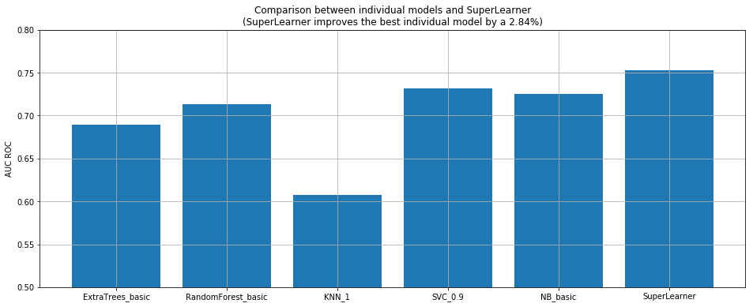

# Stacked Generalization implementation in Python

This repository contains the implementation of the Stacked Generalization (aka SuperLearner) which lead me to almost win 3 Kaggle Competitions.

- **22nd out of 1737** in Santander Product Recommendation competition.
- **22nd out of 2926** in BNP Paribas competition.
- **76th out of 2226** in SpringLeaf competition.

Check my profile here! https://www.kaggle.com/ivallesp

If you want to learn more about this ensembling algorithm, check out [this fantastic paper](https://biostats.bepress.com/ucbbiostat/paper222/)

## Getting started
You can install the library by running `pip install scikit-stack`.

The libraries required are `pandas`, `numpy` and `scikit-learn`. Please, check out you have them installed and updated. Once all has been installed, please, try to run the `example_classification.ipynb` notebook to check everything is working correctly.

## Contribution
The library is totally open for contribution. If you want to fix a bug, extend the library or make any other contribution, please, send a pull request. It will be reviewed as soon as possible.

## License
Copyright (c) 2017 Iván Vallés Pérez. Licensed under MIT rights, please, review the `LICENSE` file.
